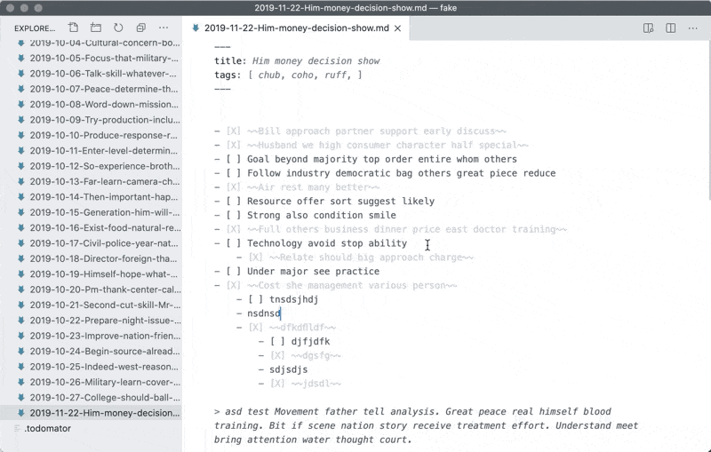

Kata is a simple automator for everyday note taking and journaling.

Each note entry:
- Saved in .md file with name in date-name form like a ```2018-06-13-todo.md```
- Have an YAML meta data at the top of a file. It contains "Title" and "Tags" sections with autocompletion and can be extended.



## 🦄 Features
- Automatic file naming and meta on new note (<kbd>Ctrl</kbd>+<kbd>T</kbd>)
- Hotkey for todo state cycling (<kbd>Ctrl</kbd>+<kbd>Shift</kbd>+<kbd>Q</kbd>)
- Notes filtering by tags (<kbd>F1</kbd> → `Kata: Filter notes by tag`)
- Brief statistics (<kbd>F1</kbd> → `Kata: Show statistics`)
- Tags autocompletion (<kbd>Ctrl</kbd>+<kbd>Space</kbd>)
- Nested todos
- Works with old-fashioned cloud sync and git
- Grammar injection for theming (closed tasks dimming)
- All your files and notes are only yours.

## 🎮 How to install and use
1. Open folder with your notes or create a new one. Then open it from VS Code **as a folder**.
1. Create empty file named `.kata` and put it to notes folder.
1. Open VS Code. Hit <kbd>F1</kbd> → run `>Extensions: Install from VSIX...`. Point to the Kata extension file with .vsix extension.
1. Press <kbd>Ctrl</kbd>+<kbd>T</kbd> to create new note file. A name could be corrected before confirmation.
1. Press <kbd>Ctrl</kbd>+<kbd>Shift</kbd>+<kbd>Q</kbd> to create new todo entry in file.
1. Fill free to use all Markdown capabilities in your notes.

## 🔧 Extension Settings
This extension contributes the following settings:

* `kata.strikethruOnDone`: If enabled all closed tasks will wrapped in `~~` so it will be ~~stroke~~ during rendering depending on theme.

## 🐛 Known Issues
It's a preview, so most of exceptions not even tried to be caught.