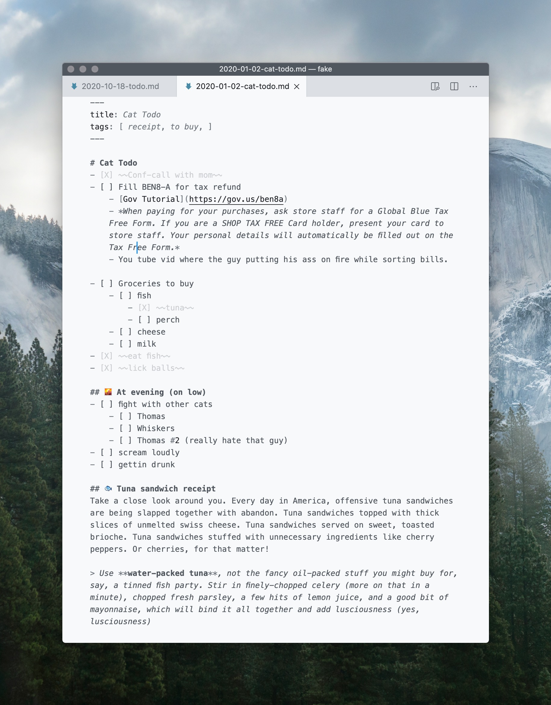
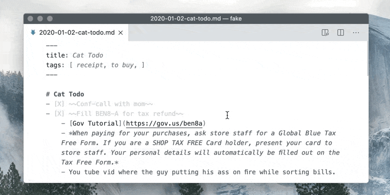
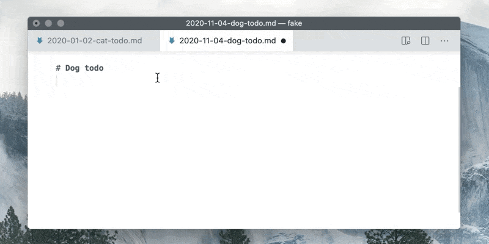
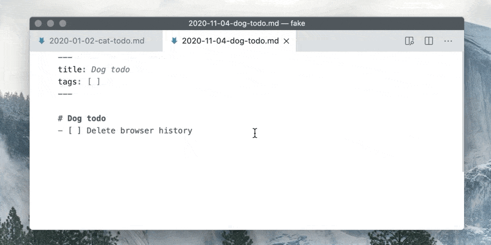
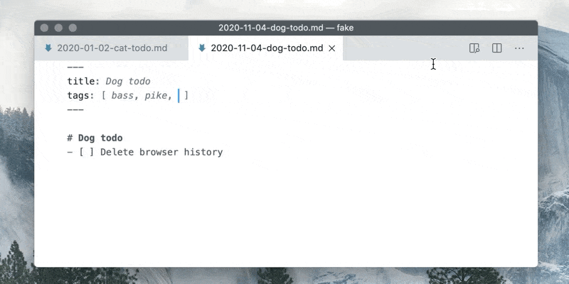

Kata is a simple automator for everyday note taking and journaling. It is a part of [Teamed with Kata](https://marketplace.visualstudio.com/items?itemName=atarity.teamed-with-kata) extension pack.

Each note entry will:
- be saved in `.md` file with name in date-name form like a `2018-06-13-todo.md`
- have an YAML meta data header. It contains "title" and "tags" sections with autocompletion and can be extended.

## 🦄 Features
### Automatic file naming and meta fill on new note (<kbd>Ctrl</kbd>+<kbd>T</kbd>)

### Hotkey for todo state cycling (<kbd>Ctrl</kbd>+<kbd>Shift</kbd>+<kbd>Q</kbd>)

### Tags autocompletion (<kbd>Ctrl</kbd>+<kbd>Space</kbd>)

### Notes filtering by tags (<kbd>F1</kbd> → `Kata: Filter notes by tag`)

### Also
- Brief stats (<kbd>F1</kbd> → `Kata: Show statistics`)
- Nested todos
- Works with old-fashioned cloud sync and git
- Grammar injection for theming ("closed" tasks dimming)
- All your files and notes are only yours.

## 🎮 How to install
1. Install Kata. Choose one of the options below:
    - directly from [VS Code Marketplace](https://marketplace.visualstudio.com/items?itemName=atarity.kata)
    - by downloading `.vsix` file from [releases section](https://github.com/Atarity/Kata/releases) (then in VS Code hit <kbd>F1</kbd> → run `>Extensions: Install from VSIX...`)
    - If you need totally the same "screenshot-like" appearance and features like wiki links, notes graph, pdf export, etc, install [Teamed with Kata](https://marketplace.visualstudio.com/items?itemName=atarity.teamed-with-kata) extension pack instead and follow steps from it's description.
1. Create empty file named `.kata` and put it to your notes directory.
1. Open your notes directory from VS Code **as a folder**.

## 🔧 Extension Settings
This extension contributes the following VS Code settings:

* `kata.strikethruOnDone`: If enabled all closed tasks will wrapped in `~~` so it will be ~~stroke~~ during rendering depending on theme. Enabled by default.
